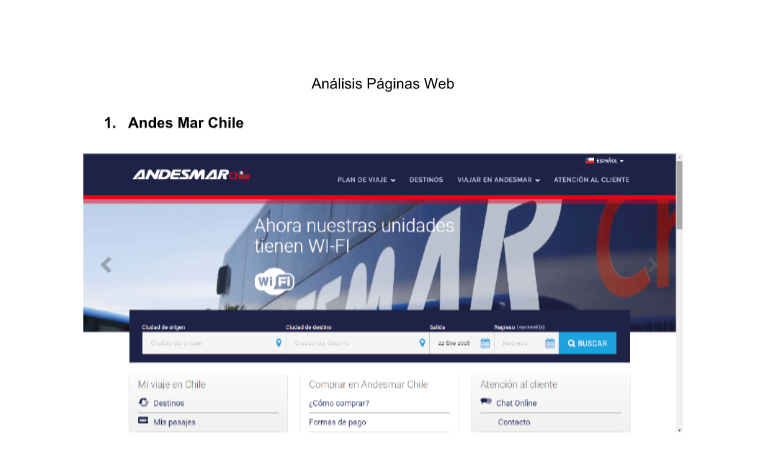
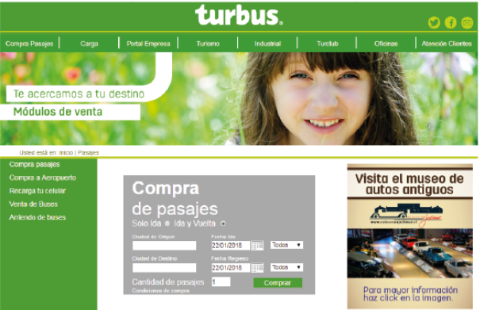
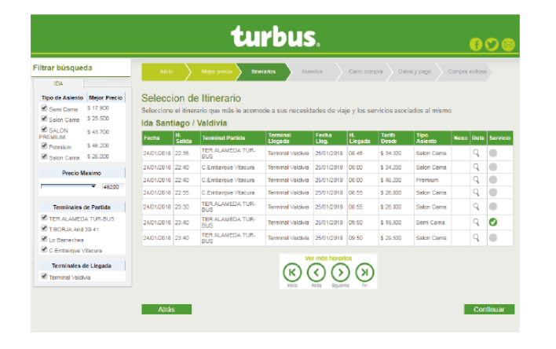
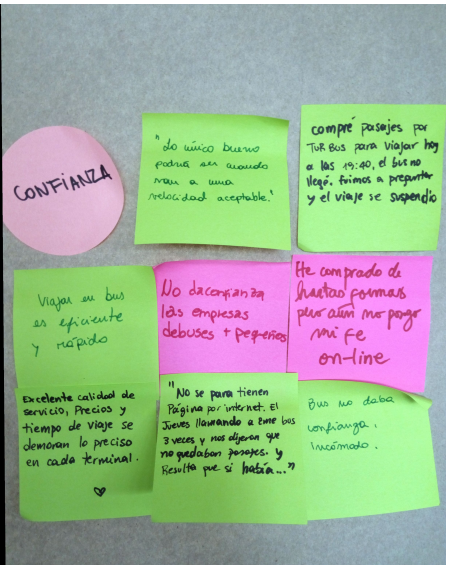
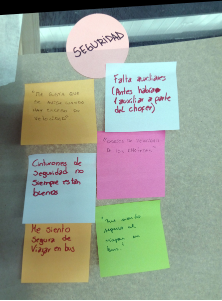
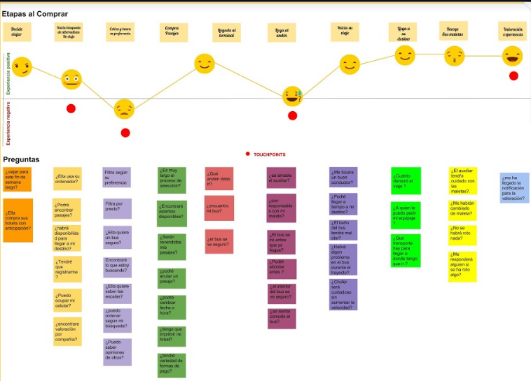

#Proyecto Safe Travel#

#Desarrollado para #
<a href="http://www.laboratoria.la/">Laboratoria</a>

*Se nos planteo el desafío de mejorar la experiencia ya existente de los viajes en buses, donde teníamos que identificar principales problemáticas del servicio y optimizarlos.*

*Para esto planificamos nuestros roles dentro del proyecto.*

*Mi rol era realizar entrevistas a usuarios que se encontraban en los terminales de buses, realizar una serie de preguntas para validar los principales puntos de presión que tenían los usuarios con el servicio.*

*En estas entrevistas se identificaron las siguientes conclusiones:*

- Los usuarios tenían un miedo constante con la seguridad del viaje.
- La capacitación de los trabajadores a bordo del bus.
- La poca disponibilidad de buses y destinos.
- Las precarias condiciones a bordo.

*Para solucionar las mismas, realizamos diferentes procesos para entender y comprender a los diferentes tipos de usuarios, compilar las perspectivas de todos ellos y resolverlas con un solo producto.*

*Los procesos fueron los siguientes:*

*Benchmark:*

*En este análisis de las competencias y paginas web actuales, se pudieron identificar las posibles opciones y ejemplos para realizar una propia de las mismas practicas.*

*Las conclusiones fueron las siguientes:*

- Enfocado en las ventas online: como comprar - devoluciones - re impresión -Formas de pago - agencias - giro de dinero (información más detallada por ejemplo como comprar online , educa al usuario).Atención al cliente: categorías por información más tienen un chat online (modal).

- Grilla más sencilla, más atractivo visualmente, énfasis en la compra de pasajes, web responsiva ,Filtrar búsqueda, visualmente esta todo a la vista, se usa de nuevo las etapas en las que me encuentro, realiza descuentos al comprar ticket online.

*Luego se aplicó un Mapa de Afinidad para poder recopilar la información realizada en las entrevistas y en los ejemplos de las demás integrantes del equipo.*

*Las ideas centrales fueron las siguientes:*

*Luego de realizar una síntesis de los datos recogidos en las diferentes investigaciones, realizamos un Customer Journey Map, para comprender cuales eran los puntos de dolor del usuario, al utilizar el servicio de buses actual. Donde se puede observar que preguntas se realiza el usuario, que acciones puede realizar y con que canales se comunica en el proceso.*

*Realice un Story Telling para poder comprender el contexto en el que el usuario actúa, además es útil para poder establecer una situación cotidiana en la que se puede desarrollar la problemática que queremos resolver.*

https://docs.google.com/document/d/15WFb1UGEBKLXTNY3mNT2zcZajaKROjdbBT5e3SwGGMg/edit?usp=sharing

*Con todos estos datos, creamos la solución a nuestro proyecto “Safe Travel” que su principal misión es ser una empresa que entrega las mejores opciones de acuerdo a sus preferencias, manteniendo su confianza antes, durante y después del viaje.*

*Nuestro prototipo con interacción, esta diseñado en versión móvil:* https://marvelapp.com/136jga16 
